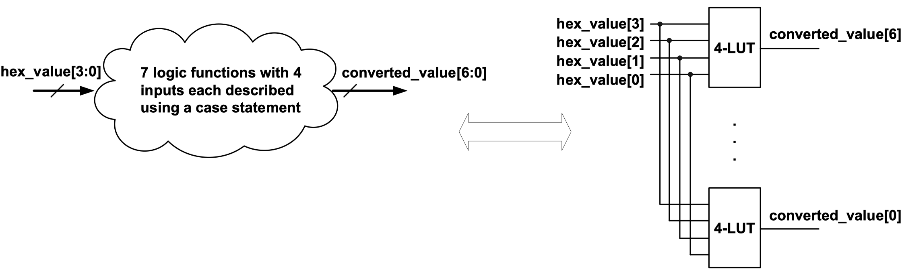

### Experiment 2

In this experiment you will get familiarized with the 7-segment-display and priority encoders. 

In subfolder **experiment2/rtl** you will find two design files associate with the project files from **experiment2/syn**. The `qsf` file contains all the project settings, including the pin assignments. The `qpf` file is the project file to be opened in Quartus (the same is followed in the remaining experiments). 

The *convert\_hex\_to\_seven\_segment* Verilog file contains the logic circuit for converting a 4-bit signal representing a hex number to the 7 signals required to control the LEDs of the 7-segment-display. Note, the LEDs of the 7-segment-display are active low. The truth tables of the 7 logic equations are not given in this document, however they can be “reverse engineered” from the `case` statement from the *convert\_hex\_to\_seven\_segment* design file. Since there are 7 logic functions with 4 inputs each, the implementation of this `case` statement takes only 7 look-up tables (LUTs) in the Cyclone IV device, as shown below.

|  |
|:--:|
|**Figure 2** – Logic implementation of *convert\_hex\_to\_seven\_segment*|

 
The priority encoder described in design file experiment2 reads switches 0 to 9 and it encodes the position of the most significant switch (that is turned on) to a 4-bit binary-coded-decimal (BCD) signal called “value”. This value will be passed to the design unit that converts a 4-bit value and passes it to the 7-segment-display. The logic implementation of the priority encoder is shown below. Note, if no switch is turned on then the displayed value will be 4’hF.
 
|  |
|:--:|
| **Figure 3** – Logic implementation of the priority encoder from *experiment2*|

You have to perform the following tasks in the lab for this experiment:

* understand the source code and verify if the priority encoder works correctly
* extend the priority encoder to read all the 18 switches from the DE2-115 board and display the position of the most significant switch onto the two rightmost 7-segment-displays in 2-digit BCD format (if all the switches are turned off then display 8’hFF).
