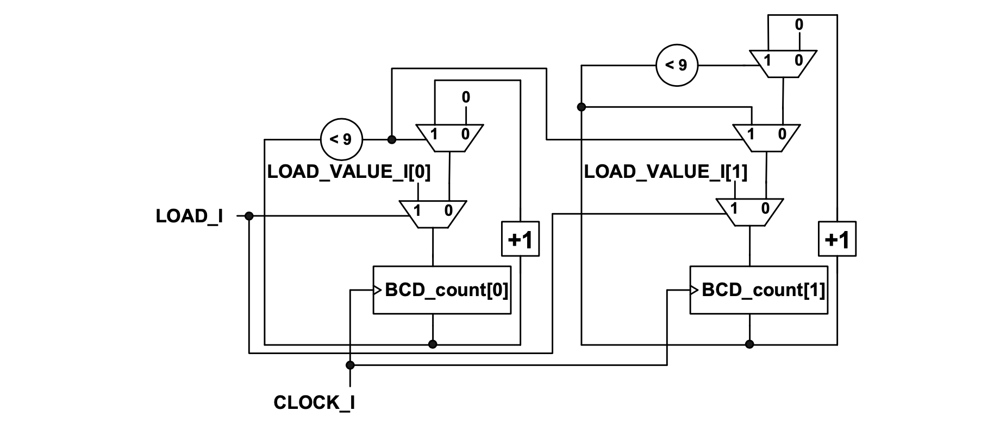

### Experiment 3

The purpose of this experiment is to better your understanding of counters. There are no implementations on the DE2-115 board for the two “sub-experiments”.
 
In **part a** you are given the code for the 1-digit BCD up-counter. Whenever the count value reaches 9 the 4-bit BCD_count register will be reset. Otherwise it counts up. The implementation is shown below.

|  |
|:--:|
|**Figure 4** – Logic implementation of the 1-digit BCD up-counter|

 
In **part b** you are given the code for the 2-digit BCD up-counter with parallel load capability. The implementation is shown below. Note, when the counter for the less significant BCD digit rolls over, it enables an increment for the counter for the more significant BCD digit.

|  |
|:--:|
|**Figure 5** – Logic implementation of the 2-digit BCD up-counter with parallel load|
 

You have to perform the following tasks in the lab for this experiment:

* simulate the two designs from parts **a** and **b** to understand how they work
