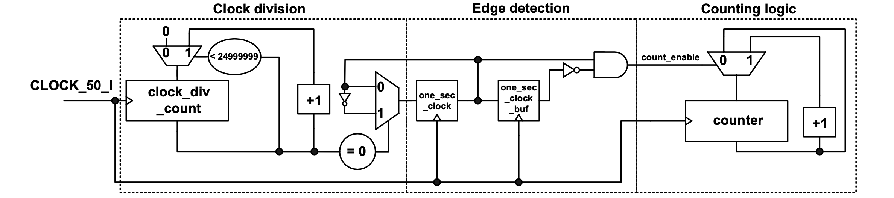

### Experiment 4

The purpose of this experiment is to introduce the concepts of clock division and edge detection, and to display the counters clocked at 1 Hz on the 7-segment-displays.

If the reference clock is 50 MHz, in order to display the counter values at 1Hz on the 7-segment-display LEDs, clock division is required. This can be done using a reference counter clocked at 50MHz. This counter is reset to zero every 25,000,000 clock cycles when it will also toggle the content of an 1-bit flip-flop (called *one\_sec\_clock*). The output of this flip-flop can be used as the 1Hz clock, as shown in the figure below. Nonetheless, there is a limitation of this approach because (due to clock skew problems) it is not recommended that outputs from some flip-flops to be used as clock inputs to any other flip-flops.
 
|  |
|:--:|
|**Figure 6** – Clock division with a low-speed clock signal driven from the output of a flip-flop|

 
This problem can be addressed if edge detection circuitry is used. At the output of the *one\_sec\_clock* flip-flop we add an additional buffer that can be used for detecting when there is one positive edge on the output of the *one\_sec\_clock* signal. Both flip-flops are synchronized at 50MHz and they are used to generate the *count\_enable* signal that is used as a synchronous enable for the low-speed counter (as shown in the figure below). Note, in the reference design from the directory experiment4 the counter value is displayed on the 7-segment-display in the hex format and the most significant switch is used as an active-low reset (this switch 17 will be used as the asynchronous reset for all the future experiments).
 
|  |
|:--:|
|**Figure 7** – Updating the counter every second using only one reference clock|

  
You have to perform the following tasks in the lab for this experiment:

* display on the 7-segment displays a 2-digit BCD up-counter (from 00 to 59) that updates every second
* repeat the previous task, however update the counter every half a second
