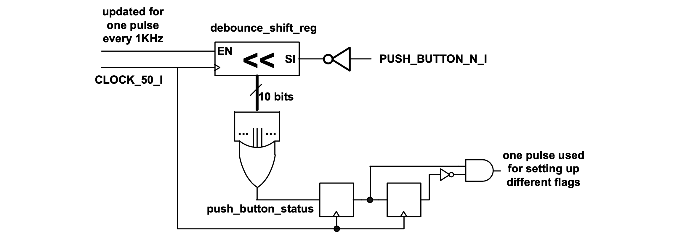

### Experiment 5

The purpose of this experiment is to introduce the concept of debouncing and controlled counters.

After pressing a mechanical switch (such as a push-button on the DE2-115 board) there is a transient period during which the switch “bounces”. The signal from the push-button (active low when pressed on this DE2-115 board) is monitored at 1KHz and its value is stored in a shift register. The enable signal for the shift register is generated in a similar fashion as the *count\_enable* signal in the previous example and it is not detailed in the figure below.
 
|  |
|:--:|
|**Figure 8** – Debouncing circuitry|

When the push-button is not pressed the content of the shift register is zero. As soon as the button is pressed the content will have at least one “1” and the push-button status will be set. So long as the value of the shift register has at least one “1”, any transients will be masked and the status of the push-button will not be updated. After the push-button is released, only after the transients have passed the value of the push-button status will be reset. Since only one action should take place each time a push-button is pressed, an edge detection circuitry on the push-button status signal is provided (it is based on the same principles as in the previous experiment). The one pulse generated by this circuitry can be used for providing the enable signals for starting/stopping counters, as shown in the example from the directory experiment5.

You have to perform the following tasks in the lab for this experiment:

* in the reference design push-button 0 is used to start/stop the counter shown on the 7-segment-displays; modify the reference code to use push-button 1 for setting the direction of counting to up and push-button 2 for setting the direction of counting to down; the counting direction can be changed irrespective whether the counter is active or not; note also, while the counter is not active if push-buttons 1 or 2 are pressed multiple times then only the last button that is pressed takes effect;
