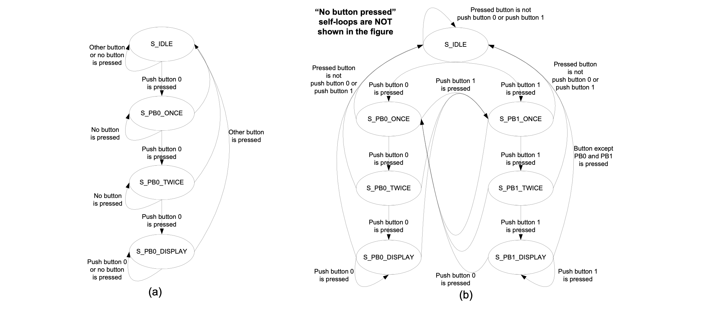

### Experiment 1

Figure 1(a) shows the FSM that corresponds to the source code from **experiment 1**, which describes an FSM that detects if push-button 0 has been pressed three times consecutively. Whenever push-buttons 1, 2 or 3 are pressed, the FSM returns to an idle state and it waits until push-button 0 is pressed again. Before returning to the state that indicates whether push-button 0 has been pressed three times consecutively, the FSM goes through two intermediate states that record if push-button 0 has been pressed once or twice consecutively. In any other state except the one where push-button 0 has been pressed for three times consecutively, the value displayed on the 7-segment-display should be “F”. 

|  |
|:--:|
|**Figure 1** - State diagrams for  *experiment 1*|

You have to perform the following tasks in the lab for this experiment:

* verify if the FSM shown in Figure 1(a) is described correctly and if its circuit implementation works
* change the FSM description in such way that if push-button 1 is pressed three times consecutively the number displayed on the 7-segment-display is “1”; note, if push-buttons 2 or 3 are pressed then the system returns to the idle state; for clarity Figure 1(b) shows the FSM to be implemented
