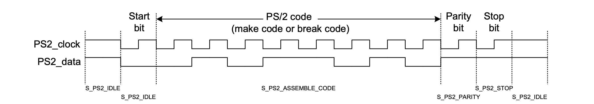
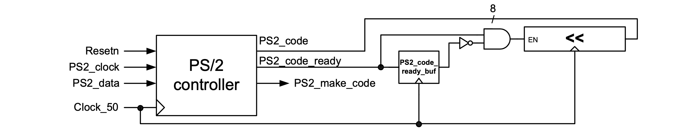

### Experiment 2

In this experiment you will learn about the PS/2 port and you will modify the FSM of the PS/2 controller.

Figure 2 shows the timing of the PS/2 interface. This interface has two bidirectional signals: `PS2_clock` and `PS2_data`. The given implementation supports only the receiver part of the PS/2 interface (i.e., we only receive data from the keyboard). If a key is pressed or released one byte of data is sent approx every ms from the PS/2 keyboard. There is a reference clock (`PS2_clock`), which is logic high when no data is sent. When the PS/2 device initiates the communication a `PS2_clock` pulse must be accompanied by a start bit (driving `PS2_data` to logic low). This is detected in the *S\_PS2\_IDLE* state. In the next state (*S\_PS2\_ASSEMBLE\_CODE*), on each edge of the `PS2_clock`, the value of the `PS2_data` is sampled into the most significant position of a right-shift register (`PS2_shift_reg`). After 8 clock cycles the parity bit is checked in the *S\_PS2\_PARITY* state (in our implementation no action is taken on this parity bit, nonetheless the state must exist in order to comply with the PS/2 protocol initiated by the keyboard). The final state *S\_PS2\_STOP* checks if the stop bit (active high) is passed with the last `PS2_clock` pulse. In the same state we set a flag `PS2_code_ready` that together with the `PS2_code` (loaded from `PS2_shift_reg`) will be passed for further processing outside of the controller. It is important to note that the FSM is clocked at 50MHz and it is enabled when a rising edge is detected on the `PS2_clock`.

||
|:--:|
|**Figure 2** - Timing diagram for the PS/2 interface|

Figure 3 illustrates the processing of the PS2 codes received from the PS/2 controller. If an edge is detected on the `PS2_code_ready` signal, the PS2 code is placed into the 8 least significant bits of a 24-bit left-shift register. This register controls the 6 rightmost 7-segment displays. Note, when a key is pressed a “make code” is generated and when a key is released a “break code” is generated by the PS/2 keyboard. For the keys that we are concerned with in this lab, the make code is 1 byte and the break code is 2 bytes (the first byte is 8’hF0 and the second one is the same as the make code). The keys supported in our simplified implementation are available in the PS2 keyboard codes [table](../../ps2-keyboard-codes.md). The `PS2_make_code` flag that comes out of the PS/2 controller module can be used to differentiate between the make codes and the break codes.

||
|:--:|
|**Figure 3** - Interfacing the PS/2 controller to the top level design|

You have to perform the following tasks in the lab for this experiment:

* check on the 7-segment displays that if a PS/2 keyboard key is pressed and released then both the make code and the break code are properly assembled by the PS/2 controller
* implement the functionality of the `PS2_make_code` flag as follows: in the state machine from the  PS2 controller set the `PS2_make_code` to a “1” only if a make code is generated; in the top level file the `PS2_code` should be passed to the shift register only if the `PS2_make_code` is set; this will enable us to “filter out” the break codes and display only the make codes on the 7-segment displays
