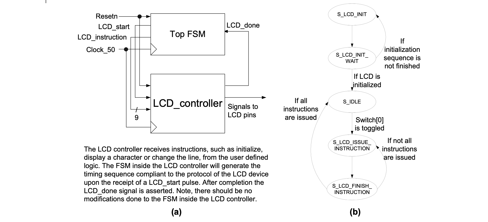

### Experiment 3

The aim of this experiment is to familiarize you with the LCD controller and its interface.

|  |
|:--:|
|**Figure 4** - LCD controller interface to top FSM and the state transition diagram of the top FSM|

 
Although the LCD interface is bidirectional, in our simplified implementation the user defined logic is only sending instructions to the LCD. The behavior of the LCD controller can be explained using Figure 4(a). After power-up an initialization sequence is provided after which the LCD controller waits for instructions, such as, for example, display a character at the current cursor position or change the line. When the user defined logic sends a new instruction to the LCD controller it must generate a rising transition on the `LCD_start` signal and provide the appropriate instruction. The instruction is on 9 bits and if the most significant bit is a “1” then the remaining 8 bits will uniquely identify the character to be displayed. Note, the supported LCD codes for the characters can be found in the LCD codes [table](../../lcd-codes.md). If the most significant bit is a “0” then the instruction is a system instruction (in our implementation we cover only the “initialization” and “change line” instructions). Note, no new instruction can be generated until the LCD controller asserts the done signal. 

The transition diagram of the top FSM that decides what kind of characters are displayed on the LCD screen is shown in Figure 4(b). The first two states are for initializing the LCD device and should not be modified. The bottom three states supply 32 character display instructions and one change line instruction. These instructions are initiated by toggling switch 0, which is required to leave the idle state. The LCD instructions are provided as constants to the `LCD_data_sequence` signal and they are looked-up using a counter (`LCD_data_index`) updated within the *S\_LCD\_FINISH\_INSTRUCTION* state. Note, after `LCD_start` is asserted in the *S\_LCD\_ISSUE\_INSTRUCTION*, it will be de-asserted immediately in the following clock cycle in the *S\_LCD\_FINISH_INSTRUCTION* state. Only then the `LCD_done` signal will be monitored to see if the LCD controller has finished its writing to the external LCD display. If this is the case, the next instruction will be sent to the LCD controller. We will return to *S\_IDLE* when all the characters have been displayed.

You have to perform the following tasks in the lab for this experiment:

* understand the behavior of the FSM from the top module and verify if the design works correctly
* change the displayed message to show your group id on the top line and lab day on the bottom line [LCD codes](../../lcd-codes.md)
