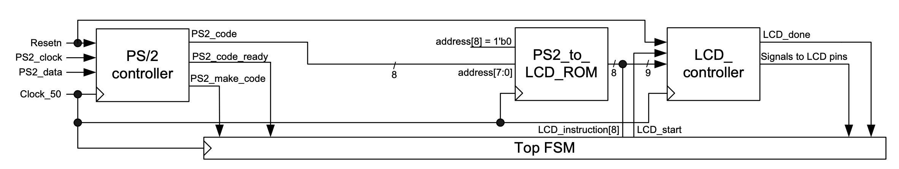

### Experiment 4

This experiment puts together the PS/2 and LCD controllers, thus displaying typed characters.

Embedded memories are part of the field-programmable array (FPGA) fabric and they can be configured either as a read-only memory (ROM), single-port random access memory (RAM) or dual-port RAM. In this lab we will be using only a ROM, which has the following ports: input address, clock and output data.  The ROM can be initialized at compile time and its content is programmed into the FPGA together with the rest of the configuration stream required for logic elements and interconnect switches. The ROM content is specified in the memory initialization file (“MIF”). The ROM content can also be initialized with a “HEX” file format.

The previous two experiments have introduced the PS/2 and LCD controllers. You have displayed the make codes on the 7-segment displays and you have printed characters on the LCD. As it is obvious that one would like to print the typed characters, the question is how can we put together the two controllers? This objective is achieved using a ROM that is employed as a code converter. Figure 5 illustrates the basic principle on how the PS/2 and LCD controllers are bridged using a ROM. 

|  |
|:--:|
|**Figure 5** – Using a ROM to bridge the PS/2 and LCD controllers|

The PS/2 controller from the figure has been updated to provide the make codes of the typed keys when the `PS2_make_code` flag is set. The ROM from the figure, stores the LCD character code in the location given by the make code. For example, since the make code for “z” is “8’h1A”, (see [PS/2 keyboard codes](../../ps2-keyboard-codes.md)), and the LCD character code for “z” is “8’h7A” (see [LCD codes](../../lcd-codes.md)), we will store 8’h7A in location 9’h01A.The ROM address is on 9 bits (and not on 8 bits as given by the make code width as shown in the figure) because the ROM has two segments. The lower segment (i.e., most significant bit is a “0”) stores the LCD code values for the lower-case characters and the upper-segment (currently unused) can be used to store the LCD code values for the upper-case characters. 

The content of the ROM is provided in the “MIF” file. When a character has been typed, it will be displayed by hooking up the lower 8 bits of the `LCD_instruction` word to the output of the ROM. The *S\_IDLE* state is left when a new make code has been detected (by monitoring a transition on the `PS_code_ready` and ensuring that `PS_make_code` is set). Because the LCD instruction is on 9 bits, the most significant bit (i.e., “1” for printing a character) is provided by the FSM from the top level design file. To change the line on the LCD display, the state machine from the previous experiment has been extended with two extra states. These two states *S\_LCD\_ISSUE\_CHANGE\_LINE* and *S\_LCD\_FINISH\_CHANGE\_LINE* ensure that after 16 characters have been typed, the LCD display advances to a new line (i.e., from the top line to the bottom line or the other way around). The instruction for changing lines is issued also by the FSM. 

You have to perform the following tasks in the lab for this experiment:

* understand the behavior of the FSM from the top module and verify if the design works correctly
* update the ROM file to support keys 0 to 9 (use [PS/2 keyboard codes](../../ps2-keyboard-codes.md) and [LCD codes](../../lcd-codes.md))
