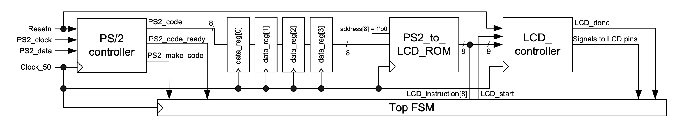
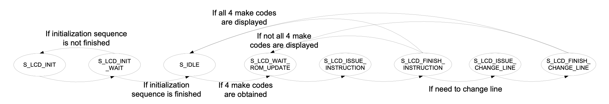

### Experiment 5

The objective of this experiment is to put together a large FSM by showing how to buffer several keys typed on the PS/2 keyboard and subsequently displaying all of them at once on the character LCD display.

|  |
|:--:|
|**Figure 6** - Using a shift register structure to buffer 4 typed keys before displaying all of them on the LCD|

Figure 6 shows how 4 data registers are connected into a shift-register structure between the PS/2 controller and the code-converter ROM. These 4 data registers are used to buffer the typed keys by storing and then shifting the last 4 make codes that were generated by the PS/2 controller. After all the 4 registers have been filled with new values, the top FSM (shown in Figure 7) will switch from the *S\_IDLE* to *S\_LCD\_WAIT\_ROM_UPDATE*. This state together with *S\_LCD\_ISSUE\_INSTRUCTION* and *S\_LCD\_FINISH\_INSTRUCTION* will enable the necessary steps to display the 4 pressed keys. When a key is printed, the shift register structure will provide the stored make code to the ROM by shifting `data_reg[i]` to `data_reg[i+1]`, while filling `data_reg[0]` with all zeros. 

The output of the most significant register from the shift-register structure (i.e., `data_reg[3]` in this example) is connected to address lines of the code converter ROM. There is one counter `data_counter` that keeps track of how many make codes have been printed and another counter `LCD_position` that keeps track of the position on the LCD screen. When putting together the state machine shown below with the above-mentioned counters and registers, the ROM can translate the 4 buffered make codes to LCD codes such that the corresponding characters are displayed on the LCD.

|  |
|:--:|
|**Figure 7** - The revised FSM for buffering 4 typed keys before printing them on the LCD|

 
This last experiment puts together the key concepts explored so far: modulo counters, shift registers, state machines, ROMs, combinational and sequential circuit blocks, design hierarchy and component instantiations, as well as the behavior of the PS/2 and LCD interfaces. Therefore, it is essential that you take your time to understand the source code, the interactions between design components, the state transitions and the effects of these state transitions on the data path registers, and the relation between the source code and the implemented hardware.

You have to perform the following tasks in the lab for this experiment:

* understand the behavior of the FSM from the top module and verify if the design works correctly
* change the shift register structure to 16 data registers, so an entire line can be displayed at once

