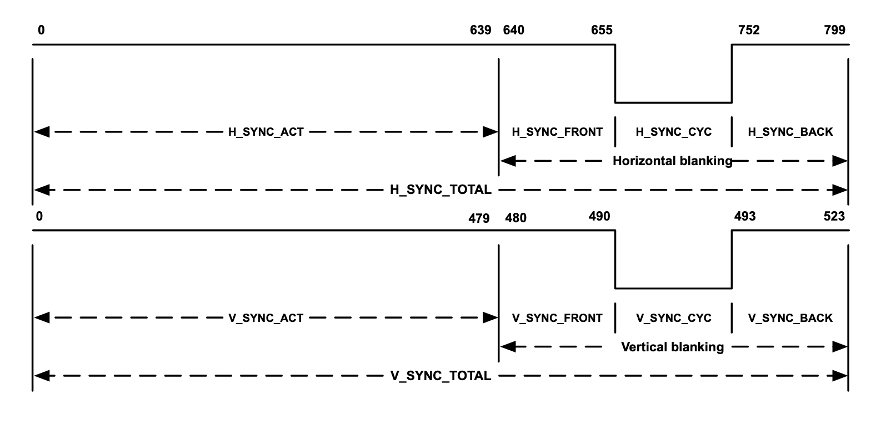
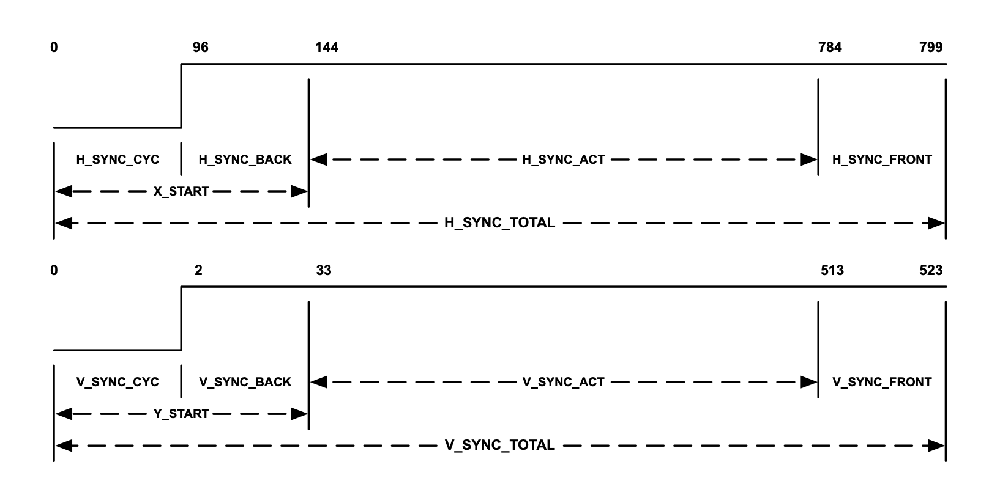
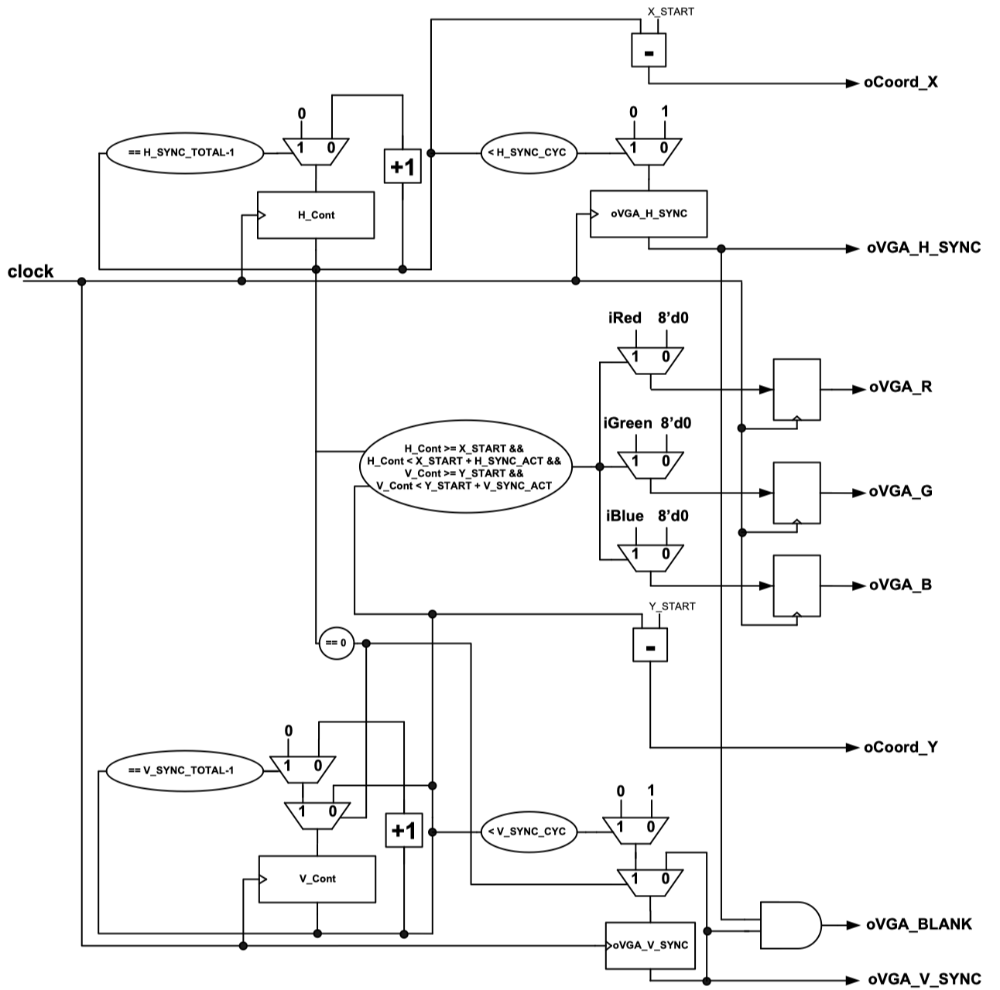

### Experiment 1

The aim of this experiment is to get you familiarized with video signals in general and the VGA interface in particular.

The VGA interface is an analog interface that was designed for (now obsolete) cathode ray tube (CRT) displays. It is also compatible with modern liquid crystal displays (LCD). It carries __*synchronization*__ (or control) and __*data*__ (or color) signals. The role of both synchronization and data signals can be explained as follows. CRTs have a phosphor-coated screen that “activates” a pixel (the smallest point on the screen that can generate light) each time an electron beam comes in contact with it. Color CRTs have three different electron beams and when in contact with the phosphor-coated screen they generate blue light (wavelength 450nm), green light (wavelength 510nm) and red light (wavelength 650nm) with different intensities. The intensity of each electron beam is controlled by the data signals (Red, Green and Blue or __*RGB*__) from the VGA interface in order to create a particular perception to the human eye. The human eye has photosensitive cells called rods and cones. Rod cells are 100 times more sensitive to light than the cone cells but because they have only one type of light sensitive pigment, they do not play any role in color vision. Cone cells respond to different wavelengths at higher light intensity, thus enabling us to see color images. 

The RGB data signals in the VGA interface are used to create an image on the phosphor-coated screen using the electron beam. The rate at which this image is displayed is controlled by the synchronization signals available in the VGA interface. If images (or frames) are updated approximately 60 times per second, an illusion of motion can be created to the human eye. Therefore, at this __*frame rate*__, the electron beam traverses the screen approx 60 times per second as follows: it starts from the top-left corner of the screen and it activates the pixels from row 0 one by one with the intensity determined by the RGB signals. Then it comes back to the left side of the screen and it activates (one by one) all the pixels from first row. After the final row is displayed, the electron beam returns to the top-left corner and it starts displaying the next frame. The two synchronization signals used to control the position and the speed of the electron beam are called horizontal synchronization (H\_SYNC) and vertical synchronization (V\_SYNC). Their waveforms are shown in Figure 1.
 
|  |
|:--:|
|**Figure 1** - H\_SYNC and V\_SYNC for the VGA mode: 640 x 480 @ 60 frames per second (fps)|

The full period of the H\_SYNC signal has four regions: active region (H\_SYNC\_ACT), front porch (H\_SYNC\_FRONT), synchronization pulse cycle (H\_SYNC\_CYC) and back porch (H\_SYNC\_BACK). The front porch together with the back porch and the synchronization pulse constitute the horizontal blanking period when no information is displayed on the screen. The synchronization pulse (active low) directs the electron beam to return to left side of the screen and start displaying a new row (the front and back porches isolate it from the active region, which is when color data is displayed on the screen). The horizontal blanking period when added to the active region gives the total period (H\_SYNC\_TOTAL) for the horizontal synchronization signal. There is one period of the H\_SYNC signal for each row (or line) of pixels that is displayed. Similarly there is one period of the V\_SYNC signal for each frame. The RGB data signals carry useful information only during active periods (H\_SYNC\_ACT and V\_SYNC\_ACT). They vary between 0mV and approx 700mV and are driven by the output of a digital-to-analog converter (DAC). The DAC receives its input values from a digital system (e.g., a personal computer or the CycloneIV device on the DE2-115 board). The video DAC on the DE2-115 board uses a precision of 8 bits per color, which translates into 256 distinct intensities for each of the colors. 

There are two important points worth making:

* The period of the synchronization signals determines the resolution of the video mode and its frame rate. For example, if the reference clock is 25 MHz and the targeted resolution is 640x480 (i.e., 640 pixels per line and 480 lines per frame, also called the VGA mode) then the period of the H\_SYNC signal is approx 32 us (800 clock cycles for H\_SYNC\_TOTAL multiplied by 40 ns for each clock cycle). The number of clock cycles (for each of the regions of the H_SYNC signal) is shown in Figure 1. The period of the V\_SYNC signal is 16.768ms (524 lines and 32us are spent for each line). This translates into a frame rate of approx 60 frames per second. The number of lines (or H\_SYNC periods) for each of the V\_SYNC regions is also shown in Figure 1. Therefore, by changing the reference clock (also called the __*pixel clock*__) and the duration of the active and blanking periods, one can change the resolution of the video mode (obviously, so long as the targeted CRT or LCD can support it). For example, as it can be found in the VGA parameters file from the experiment1 directory, if the pixel clock is 50 MHz one can change the video mode to SVGA, i.e., 800 x 600 @ 72 fps.
* The combination of the three data signals (RGB) can create other colors. For example, if R, G and B are all set to their highest intensity (700mV) then the resultant color is intense white. If R, G and B are all set to half their intensity (350mV) a gray color of medium intensity will be displayed on the screen. If red is combined with green, then yellow will be displayed. Green combined with blue will generate cyan. A mixture of red and blue will display magenta. Depending on the combination of RGB values we can obtain: black (000), blue (001), green (010), cyan (011), red (100), magenta (101), yellow (110) and white (111). If there are 256 levels for each of the RGB signals, the total number of distinct colors that can be generated is 256 x 256  x 256, which gives just above 16 million colour variations (this colour depth is commonly referred to also as true colour).

The next step is to understand the VGA controller provided in the experiment1 directory. It generates a shifted version of the H_SYNC and V\_SYNC signals as shown in Figure 2.
 
|  |
|:--:|
|**Figure 2** - H\_SYNC and V\_SYNC as generated by the VGA controller|

The implementation of the VGA controller (shown in Figure 3) is simple and it comprises of a couple of modulo counters and steering logic. The two counters reset to zero after reaching H\_SYNC\_TOTAL-1 and V\_SYNC\_TOTAL-1 respectively. Two synchronization flip-flops drive the sync pulses to the VGA port. They are zero only when the two modulo counters are less than H\_SYNC\_CYC and V\_SYNC\_CYC respectively. The VGA controller provides the oCoord\_X and oCoord\_Y signals to the rest of the design. These signals carry the information on where exactly is the electron beam with respect to the H\_SYNC and V\_SYNC signals. Using the information from oCoord\_X and oCoord\_Y the user can drive the iRed, iGreen and iBlue signals. These three signals are inputs to the VGA controller and they are buffered in order to be synchronized with oVGA\_H\_SYNC and oVGA\_V\_SYNC before being sent to the VGA port. Note, the RGB signals are disabled during the blanking periods, as it is requested by the VGA interface. The clock signal usually comes from a phase locked loop (PLL) instantiated as a component. For the 640 x 480 @ 60 fps mode the 25 MHz should be used and for the 800 x 600 @ 72 fps the 50 MHz should be used. Note, in our current implementation we avoid the PLL by using only the 50 MHz clock and enabling the registers every other clock cycle for the 640 x 480 @ 60 fps mode.
 
|  |
|:--:|
|**Figure 3** - The implementation of the VGA controller|

In **experiment 1**, the iRed, iGreen and iBlue signals are driven by the complements of bits 8, 7 and 6 of the horizontal counter. Depending on the position of the least significant switch, this will create different vertical/horizontal color bars (for the VGA mode), each of them of width/height equal to 64. You have to perform the following tasks in the lab for this experiment:

* verify that the design works correctly and change the resolution from VGA to SVGA
* in the VGA mode, display vertical/horizontal color bars that are 32 columns/lines wide/high each
