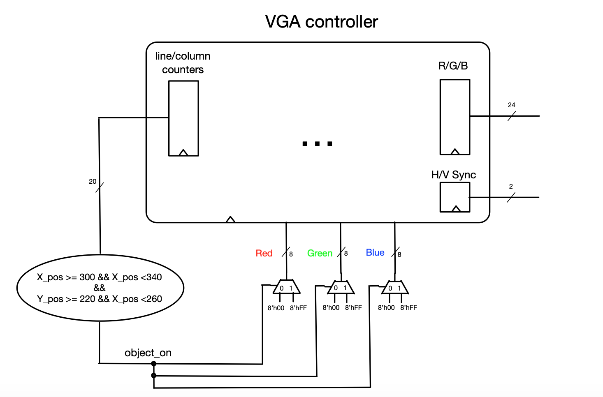

### Experiment 2

This experiment shows how to put together user-defined logic blocks that are synchronized with the VGA controller in order to display objects on the screen. The oCoord\_X and oCoord\_Y signals from the VGA controller are mapped onto the pixel\_X\_pos and pixel\_Y\_pos signals in the top level design (as shown in Figure 4). These two signals are also referred to as the column counter and line (or row) counter respectively. Using these two signals we determine what color to display for each pixel. Therefore, if we drive a signal *object\_on* to a “1” only when the column counter is between 300 and 340 and the row counter is between 220 and 260, and then we use this signal to turn on VGA\_red, VGA\_green and VGA\_blue; consequently a white rectangle will be displayed with its top-left corner at (300, 220) and its width and height equal to 40. 
 
|  |
|:--:|
|**Figure 4** - Interfacing the VGA controller to user defined logic|

The above-described principle can be used to display borders, objects, even characters as seen in later experiments. To understand how you can put them together, you have to perform the following tasks in the lab for this experiment:

* draw seven non-overlapping rectangle objects of different colors (same colors from experiment1 except black)
* understand which are the critical paths in the design, including their source and destination registers
