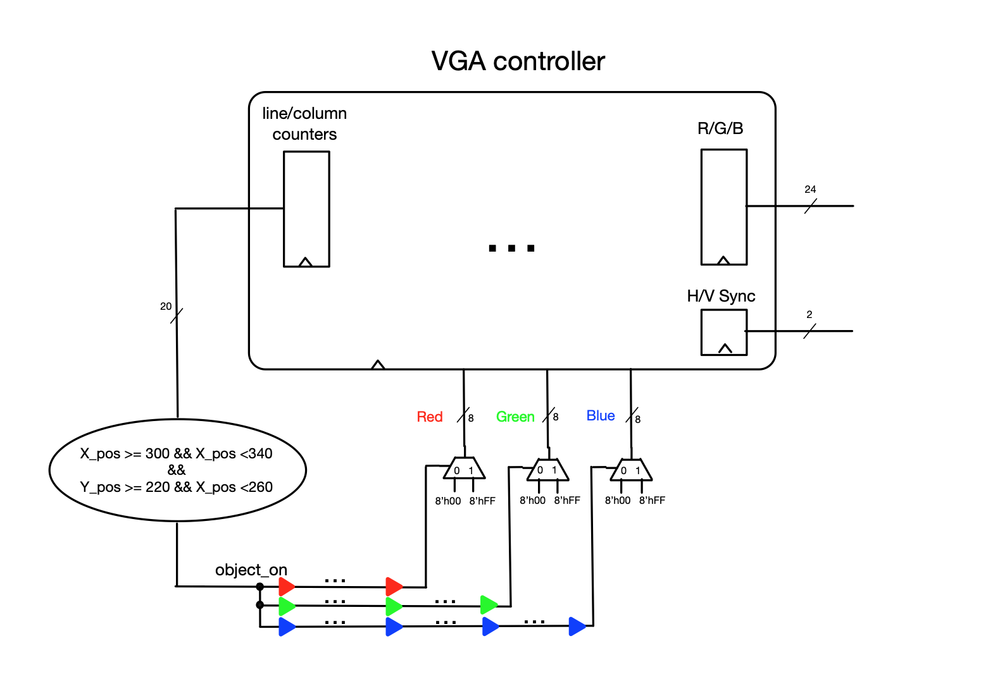

### Experiment 3

The purpose of this experiment is to illustrate what happens if digital circuits are “over-clocked”.

A common problem in digital systems is the occurrence of __*timing violations*__. The main objective of this experiment is not to go to the fine level of details to fix these timing violations, but rather to illustrate their effects, and to understand the principle of pipelining used to fix them.

|  |
|:--:|
|**Figure 5** - Introducting long propagation delays using combinational delay chains|

In Figure 5, the _object\_on_ signal drives a long combinational delay chain (implemented using an user-defined number of instances of the LCELL component specific to this Altera device); this primitive component maps onto a logic element (LE) configured as a repeater that has **no** functional meaning, however it adds extra combinational delay. Since, in this experiment _object\_on_ is used to drive all of the R, G and B signals (and hence produce a white box in the middle of the screen), we **_artificially_** create unequal propagation delays from the column/line counters (H\_Cont/V\_Cont registers from the VGA_controller) to the oVGA\_R, oVGA\_G and oVGA\_B registers (also in the VGA controller). By construction, these propagation delays will exceed the timing budget for the pixel clock. When the color registers (oVGA\_R, oVGA\_G and oVGA\_B) update their values (i.e., when the color on the screen changes from black to white or vice-versa), the samples acquired on the edge of the clock will not be the correct ones because the propagation delays through the _long combinational paths_ have not been settled. This explains the visual artifacts that can be observed on the screen. 

As this is an artificial example that creates unnecessarily long combinational delays in the circuit (using the LCELL primitive), fixing this timing problem is trivial, i.e., by removing the functionally-redundant LCELL instances. For real-life situations, pipelining and retiming are most commonly used. When pipelining is employed, by changing the hardware description, additional artificats might arise, which is the focus of the next experiment. 
 
You have to perform the following tasks in the lab for this experiment:

* understand how to perform timing simulation (using the `timing.do` rather than the `run.do` script) on the synthesized netlist and how it differs from functional register-transfer level simulation
* observe the timing violations through timing simulation and understand the pipelining approach commonly used to address them

