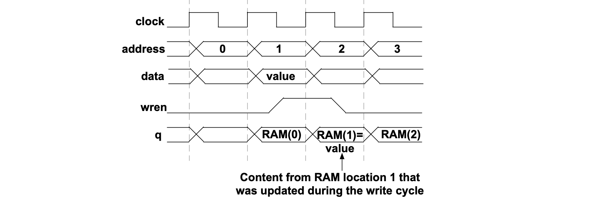
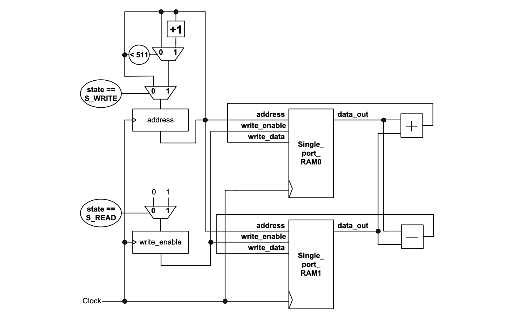

### Experiment 2

The aim of this experiment is to understand the functionality of embedded RAM blocks. 

Programmable logic devices contain embedded memory blocks that can be configured as ROMs or single-port RAMs or dual-port RAMs (or DP-RAMs). They are necessary for avoiding storing large amounts of state information in on-chip registers. They are suitable for implementing the first level of caches in memory systems. The difference between having a RAM on-chip vs. off-chip lies in the fast memory access time on-chip. Furthermore, having multiple memory blocks facilitates concurrent access of data in all the embedded memories, thus avoiding accessing a shared resource off-chip (this avoids memory access bottlenecks that can slow down the performance of computer systems).  

|  |
|:--:|
|**Figure 2** – The memory access waveforms for single-port RAMs |

As shown in Figure 2, for single-port RAMs the write enable signal (_wren_) decides whether the memory cycle is a READ or a WRITE. For the given RAM configuration, after the address is applied to the inputs, the output data will be available after the edge of the clock cycle. If _wren_ is high then the data available on the input port will be written to the memory location determined by the address bits on the next edge of the clock cycle.

To better understand the benefits of embedded RAMs, this experiment and the next one show how values from two arrays of 512 elements, and 8 bits per element, can be read, added and subtracted, and subsequently these results stored back to the embedded RAMs. In Figure 3 an implementation with 2 single-port RAMs is given. The single-port RAMs share the same address register and write enable. The data is first read from a location determined by the address register and in the following clock cycle the address register is kept the same while the addition and the subtraction results are written back to the embedded RAMs by activating the write enable signal.
 
|  |
|:--:|
|**Figure 3** – Circuit from __experiment 2__ implemented using 2 single-port RAMs |

You have to perform the following tasks in the lab for this experiment:

* verify the correctness of the design through simulation; note, the 8-bit values that are read from the embedded memories have been initialized using MIF files available in the rtl subfolder; note also, at the end of the simulation, the content of the embedded memories will be dumped in .mem files in the sim subfolder; it is also worth mentioning that in the case of arithmetic overflows, no correction is applied, i.e., the 8 least significant bits of the result are stored in the memory
