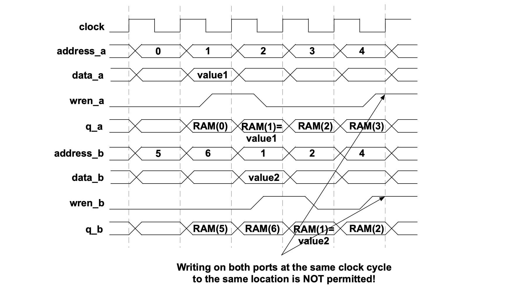
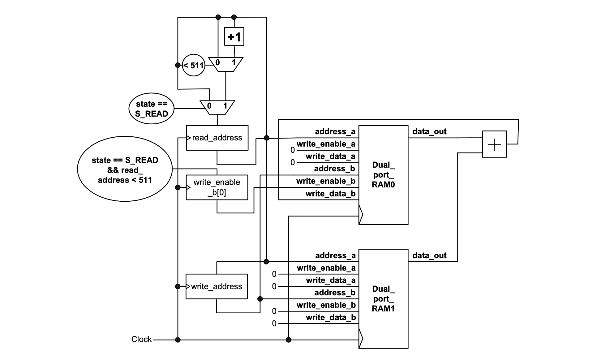

### Experiment 3

The aim of this experiment is to help you understand the key benefits of dual-port RAMs (DP-RAMs).

The basic DP-RAMs support reading on both ports or reading on one port and writing on the other port. For true DP-RAMs, data can be written on both ports. Note however if a write to the same location is attempted on both ports at the same clock cycle a hazard will occur, which may push the system into meta-stability (i.e., the value from the respective address will be undefined).

|  |
|:--:|
|**Figure 4** – The memory access waveforms for dual-port RAMs |
 

This computation for the array calculations from __experiment 2__ can be accelerated by using two dual-port RAMs of the same capacity. There will be two distinct address registers (one for reading and one for writing).  Unlike the case where the single-port RAM is employed, the read address register is incremented every clock cycle. This register will be hooked up to a read port while the write address register (delayed by one clock cycle) is connected to a write port. Because (by design construction) the read address and write address registers will not conflict, a new result can be written back to the memory every single clock cycle.
 
|  |
|:--:|
|**Figure 5** – Circuit with the same behavior as the circuit from __experiment 2__ implemented using 2 dual-port RAMs (to be completed) |
 

You have to perform the following tasks in the lab for this experiment:

* in the code from folder __experiment 3__, the addition of the values read from the two RAMs is stored in the top RAM; extend the dual-port implementation (shown above) in such way that the subtraction of the values read from the two RAMs is stored in the bottom RAM
* understand the speed-up facilitated by dual-port RAMs over single-port RAMs
