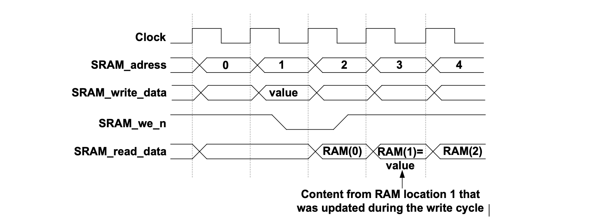
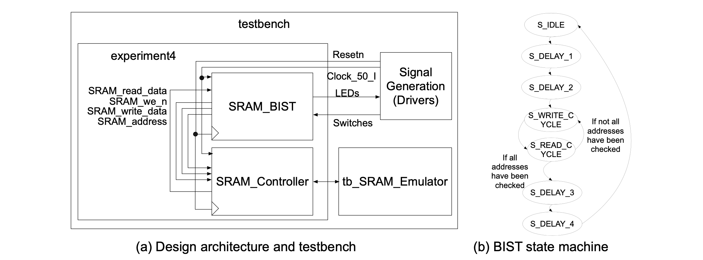

### Experiment 4

The objective of this experiment is to introduce the external SRAM and to show how it can be used and modeled.

First, it is important to note that although the capacity of the SRAM device on the DE2-115 board is 2 MB (accessed by 20 address lines and 16 data lines), for the rest of this course we will use the external SRAM in the following mode: 18 address lines and 16 data lines (organization of 256k locations with 16 bits per location). This is because the source code was originally developed for a previous version of the DE2 board … and, not surprisingly, there were a total of 18 address lines for the respective SRAM device. Nonetheless, it is worth noting that working with less memory brings hurdles that are common for many form-factor constrained systems and that make some design decisions more intellectually challenging.  Furthermore, working with smaller data sets stored in the external memory is indirectly advantageous in terms of clock cycles that need to be simulated, without avoiding the more challenging verification challenges that provide the basis for an improved learning experience.

The SRAM controller implemented for the external SRAM device has the memory access cycles shown in Figure 6. Note, although the latency for both reading and writing is 2 clock cycles, it does have a throughput of one result per clock cycle, i.e., in any clock cycle we can initiate a read or a write that completes two clock cycles later. Note also, the write enable for the external SRAM is **active low**.

|  |
|:--:|
|**Figure 6** – Memory access waveforms to the external SRAM controller|

In the __experiment 4__ folder, a simple built-in self-test (BIST) engine is designed for the SRAM device. BIST is an enabling technology that is essential for characterization, test and diagnosis of high-density memory devices. The circuit architecture and its testbench are shown in Figure 7(a), while the state machine for a reference BIST engine is given in Figure 7(b). The BIST engine employs a counter that iterates through the entire memory space of the SRAM and it reads back the value that has just been written. In the case of a mismatch an error flag will be set. The key point of this experiment is the use of an SRAM emulator for simulation purposes. Because the SRAM is an external reactive device (i.e., it responds to the requests given by our circuit) it is essential that its behavior is accurately modeled in the verification testbenches.

|  |
|:--:|
|**Figure 7** – Circuit to support the SRAM BIST engine (including its testbench and state machine)|

 
You have to perform the following tasks in the lab for this experiment:

* understand how an emulator module can be used for simulating an external device, such the external SRAM from this experiment
* in the given source code the memory BIST is done by reading back the value which has just been  written in the SRAM; modify the code in such way that all the values are written in the SRAM in a _burst_ mode (the data value equals the lowest 16 bits of the address); then all the values from the memory should be read back and compared against the expected values generated on-chip; prove that your design works first through simulation
