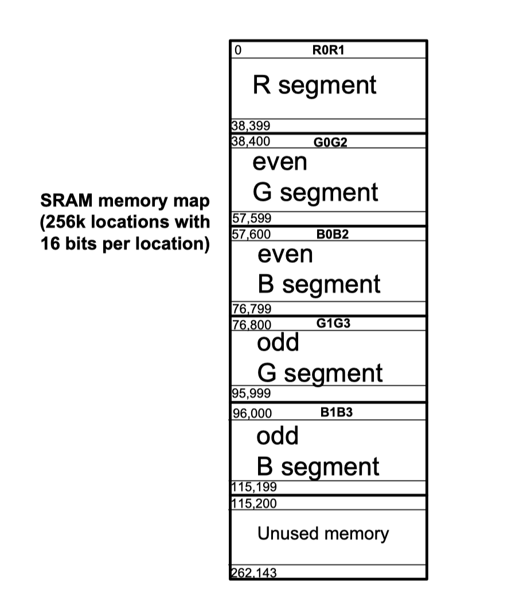

### Exercise

Implement the state machine that displays the same image as __experiment 1__, when accounting for the following changes to the memory layout.

|  |
|:--:|
|**Figure 10** – The segmented memory map for this take-home exercise |

The external SRAM memory is organized in five memory segments, as shown in Figure 10 above.

* The first memory segment stores all the R values (the “R segment”)
* The second memory segment stores all the even G values (the “G segment”)
* The third memory segment stores all the even B values (the “even B segment”)
* The fourth memory segment stores all the odd G values (the “odd G segment”)
* The fifth memory segment stores all the odd B values (the “odd B segment”)

The "R segment" starts at 0 and it has 38,400 memory locations. The first location from the R segment stores the red color values for pixels 0 and 1. The second location from the R segment stores the red color values for pixels 2 and 3, and so on.

The number of memory locations in each of the two G segments (odd and even) is 19,200 (their starting addresses are provided in the above figure). The first location from the "even G segment" stores the green color values for pixels 0 and 2. The second location from the "even G segment" stores the green color values for pixels 4 and 6, and so on. The first location from the "odd G segment" stores the green color values for pixels 1 and 3. The second location from the "odd G segment" stores the green color values for pixels 5 and 7, and so on. The same principle holds for the  "even B segment" and the  "odd B segment".

It is **critical** to note that the starter code from the `exercise/rtl` sub-folder already writes the image from __experiment 1__ into the SRAM (using the SRAM fill states) that follows the memory map described in the figure above.  Your task is to **_modify_** the **_read_** states (which are left unmodified from the FSM from __experiment 1__) in order to account for the change in the memory map from the figure above.

In your report write a full-page that describes your reasoning. You must discuss your resource usage in terms of registers. You should relate your estimate to the register count from the compilation report in Quartus. You should also inspect and interpret the critical path, as shown in the videos on circuit implementation and timing from lab 3, as well as the additional video prepared for this take-home exercise. 
To keep your thought process organized, it is requested that in your report you summarize the purpose of registers by following the format from this [appendix](./appendix-register-description-example.md). Note, while keeping track of the registers will prove to be essential to stay organized during the project, in the report for this lab you should focus **_only_** on the registers from the top-level module that are needed for reading the R/G/B data from the external SRAM and transferring it to the VGA controller, i.e., registers used by the code from the **_read_** states that need to be **_modified_** by you.

Your sources should follow the directory structure from the in-lab experiments (already set-up for you in the `exercise` folder); note, your report (in `.pdf`, `.txt` or `.md` format) should be included in the `exercise/doc` sub-folder. Note also, your design must pass compilation in Quartus before you simulate it and you write the report.

For your group's deadline please check the top-level [README](../../README.md) file. Late submissions will be penalized.
