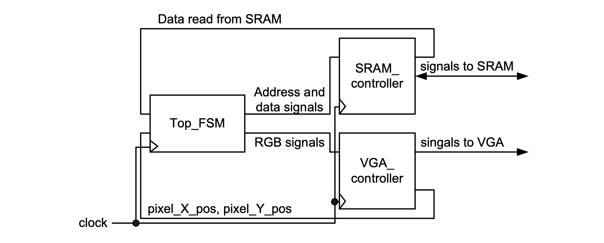
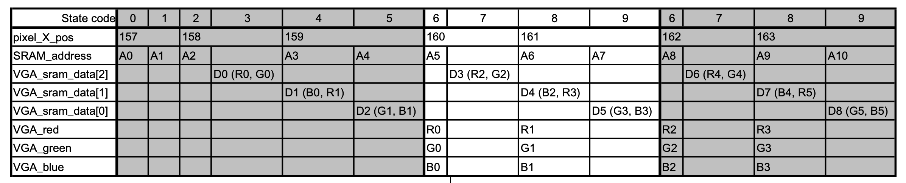
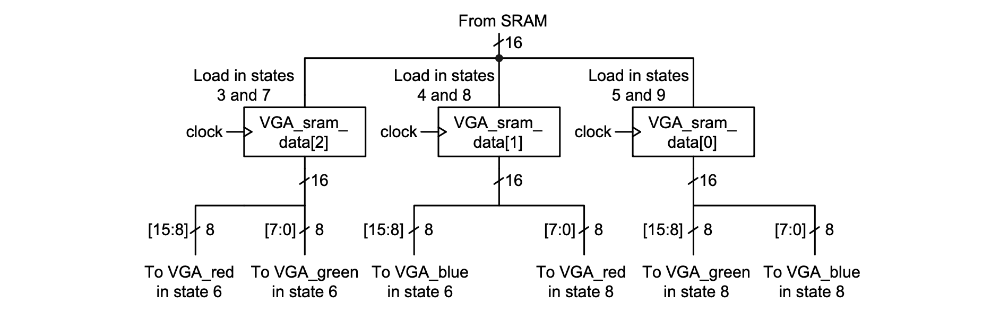

### Experiment 1


The aim of this experiment is to show how the external SRAM is interfaced to the VGA controller. 

|  |
|:--:|
|**Figure 1** – Top-level diagram for the circuits from __experiment 1__ and __experiment 2__|
<a name="top-level-vga-sram"></a>

After a picture of size 320 x 240 is generated on-chip and stored in the SRAM, it is read by an FSM that passes it to the VGA controller for displaying it in the center of the 640 x 480 VGA screen. The SRAM organization determines how the data is transferred between the two controllers. First, it is important to note that all the internal flip-flops are clocked at 50 MHz with the exception of a couple of control signals in the SRAM controller (as required by the SRAM protocol; this detail is not relevant to the system integrator). Note however although the VGA controller’s flip-flops are clocked at 50 MHz, they are enabled every other clock cycle. Because the SRAM has only 2 bytes per location, we use one location to store the 8 most significant bits for two colors as follows: location 0 stores RG for pixel 0, location 1 stores BR for pixels 0 and 1 respectively and location 2 stores GB for pixel 1, …. Thus to provide 6 colors for 2 pixels, 3 memory reads are done every 4 clock cycles (SRAM is clocked at 50 MHz and the 3-byte color data is passed every second clock cycle to the VGA controller). 

The “Top FSM” from Figure 1 is used to direct how the data is fetched from the SRAM and transferred to the VGA. The inner behavior of this FSM can be explained using Table 1 and Figure 2. Note the state transitions for filling in the SRAM are not covered in the state table, however its burst sequence can be inspected in the source code (there is no need to modify SRAM filling part for any experiment in this lab).

|  |
|:--:|
|**Table 1** – State table for __experiment 1__|
<a name="state-table-exp-1"></a>

Because the picture is displayed from column 160, the SRAM must supply the appropriate RGB data at the right time. This is achieved by addressing memory location 0 (A0 in column 2, row 3 in the table) six clock cycles ahead. After A0 is generated, the data will “arrive” from the SRAM two clock cycles later and it will be buffered in the VGA\_sram\_data register in state 3. The first memory location will pass the red and green information for pixel 0 (R0 and G0). Note, the “State code” from the table is the one given by the state enumeration from the source code and it is used to show that once the data has started to be fetched, the same state sequence (states 6 to 9) is repeated until the end of the viewing area (on the currently displayed line) is reached. The same sequence is resumed when the following line is displayed. 

One key point about state tables is that it is at the designer’s discretion to define what is shown for each state: when the data transfer is specified in the source code or when the data is actually valid. Consider the following example in an `always_ff` block:

```bash
…
case (state)
…
		Sx: 	begin
				regA <= some_value;
				state <= Sy;
			end
		Sy:	…
…
```

If we show entry `some_value` in row `regA` and column `Sx` then it is also important to be aware of the fact that regA will update to some_value in the following clock cycle when the state has already become `Sy`. Conversely, if we choose to show when the data is valid, i.e, entry `some_value` in row `regA` and column `Sy`, then it is important to specify the data transfer in the source code in the previous clock cycle (which is in state `Sx` in this example) that `regA` will be updated to `some_value` in the next clock cycle (state `Sy`).

|  |
|:--:|
|**Figure 2** – Data transfer between the SRAM interface and the VGA interface for __experiment 1__|
<a name="data-transfer-exp-1"></a>

The three VGA\_sram\_data registers (16 bits each) are necessary to buffer the RGB data for the next two pixels before they are transferred to the VGA controller in states 6 and 8 respectively. They are needed because there are only 2 bytes of data in one memory location, while each pixel requires 3 bytes (every second clock cycle because the clock is 50 MHz). 
  
For this experiment, there are no coding tasks to be completed in the lab. All you need to do is to simulate the design, inspect the testbench and the wave window and understand the concept of state tables. 
> 