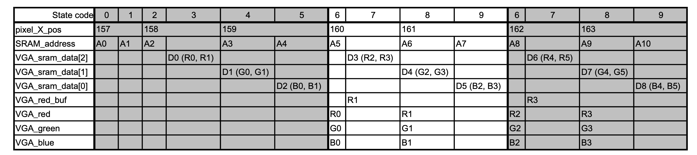
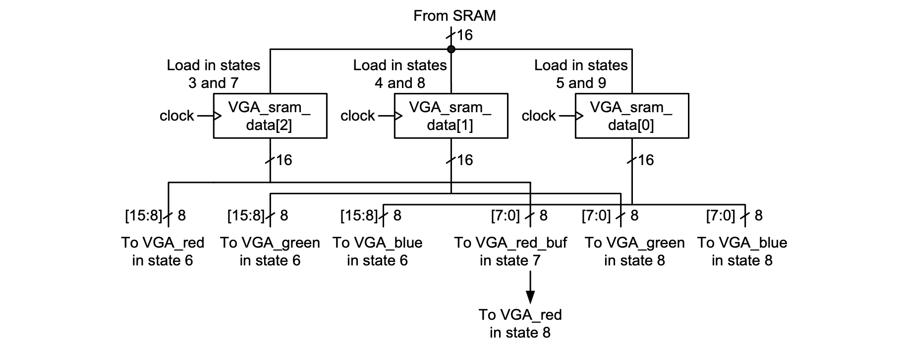

### Experiment 2

Modify the design from experiment 1 in such way that the memory layout is changed from RG, BR, GB, RG, … to RR, GG, BB, RR, …; the first location has the red values for pixels 0 and 1 (from the viewing area); the second location has the green values for the first two pixels; …. 

|  |
|:--:|
|**Table 2** – State table for __experiment 2__|

 
Several points are to be noted:

* to ease your development the state table for reading the new memory layout is given in Table2; note, the data that comes from the SRAM is organized as (R0, R1), (G0, G1), (B0, B1), …
* the reference design files are given in the experiment 2 folder; the states for filling in the SRAM are already given; the reading states are the same as in experiment 1 and you will need to change them in order to match the memory layout described above
* note, in state 7, VGA\_sram\_data[2][7:0] must be buffered in “VGA\_red\_buf” in order to avoid being overwritten by the incoming data; this buffered value is to be passed to the VGA controller in the following clock cycle (this is also illustrated in the diagram shown in Figure 3)
* your modified design must first pass the testbench before being placed on the board

|  |
|:--:|
|**Figure 3** – Data transfer between the SRAM interface and the VGA interface for __experiment 2__|

