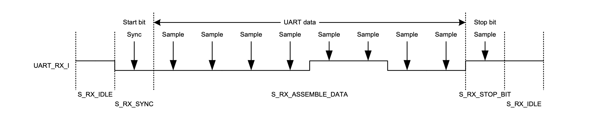

### Experiment 3

This experiment introduces the UART interface which is commonly used for serial communication between digital devices. To communicate through an UART interface two separate paths are needed: one for transmitting and one for receiving data, as shown in Figure 4. In the following we will introduce the UART protocol and the state machines from the design implemented in the DE2-115 board. These state machines are used to receive/transmit 512 bytes of data from/to the host, such as a personal computer (PC).
 
|  |
|:--:|
|**Figure 4** – Circuit using the UART interface for __experiment 3__|

The UART interface is asynchronous because it does not have a dedicated clock line and it recovers the timing information from the data stream by monitoring the start and stop bits, as shown in Figure 5. In our implementation each packet of data embedded between a start and a stop bit has 8 bits (the number of bits can vary between 5 to 8, depending on the settings of the UART protocol). The data can be sent at different baud rates (which we assume and use them as bit rates) varying most commonly from 1,200 bits per second (bps) to 115,200 bps. Additional info (such as type of parity, handshaking, longer duration for stop bits) can be used in the communication protocol between two UART devices. For the sake of simplicity, we have implemented our UART controller to accept data at 115,200 bps, 8 data bits, no parity, 1 stop bit and no handshaking. 

|  |
|:--:|
|**Figure 5** – The timing diagram of the UART protocol |

 
The waveform (that is initiated by the transmitter) is shown in Figure 5. For this example, the transmitter sends the value 8’h30 (the first data bit on the left-hand side is the least significant bit of the byte that is assembled). After the receiver senses a negative edge on the UART\_RX\_I line, it will go into a sync state to confirm the presence of the start bit. Due to the asynchronous nature of the UART protocol, it is required that the receiver samples the data half-way during the transmission time of each bit. Since in our implementation we use a 50MHz reference clock, in order to receive data at 115,200 bps, we employ a counter that goes from 0 to (434/2 -2) before a sampling occurs (434 is approximately 50,000,000 divided by 115,200, which gives the number of 20ns pulses for the duration of 1 bit of received data). This ensures that successive samples will occur roughly in the “middle” of the receive time of each bit.

|  |
|:--:|
|**Figure 6** – State transition diagrams for the UART receiver|

 
The state transition diagram of the UART receiver is shown in Figure 6(b). This state machine assembles data bit by bit and it passes the bytes to an FSM in the top-level design whose state transition diagram is shown in Figure 6(a). The FSM from Figure 6(a) (encapsulated in box RX\_FSM from Figure 4) controls the UART receiver by deciding when the receiver should be enabled and when the data should be off-loaded for processing (in our case the only processing is storing the received bytes in a dual-port RAM). If the UART receives a new byte before the old one has been processed an overrun flag will be set. If the start/stop bit protocol is violated, a frame error flag will be raised.

The state transition diagrams of the TX\_FSM (from Figure 4) and the UART transmitter are shown in Figures 7(a) and 7(b) respectively; the TX_FSM reads the data from the embedded memory and it will control the UART transmitter by providing 1 byte of data at a time; this data needs to be loaded in the data buffer when start becomes a 1 in the S\_TX\_IDLE state from Figure 7(b) (at the same time the Empty flag and the data count register need to be cleared). The UART transmitter FSM will subsequently serialize the data buffer according to the UART protocol (illustrated in Figure 5); it is important to note that to achieve transmission at exactly 115,200 bps, it is required to use an additional clock. More precisely, a 27 MHz oscillator from the DE2-115 board will supply the reference clock to an internal phase-locked loop (PLL) that generates an internal 57.6 MHz clock; this clock will subsequently be divided by 500 to obtain 115.2 KHz, as it is required to transmit data at 115,200 bps. 

You have to perform the following tasks in the lab for this experiment:

* understand how the receive part of the UART interface works; note, when working on the board, a rising transition on switch 0/1 must be done each time before sending the data to/from the board from/to the host
* complete the code for the UART transmitter (in the `UART_transmit_controller`) where the `UART_TX_O` output is assigned to a don't care value (recall Start bit is 0, Stop bit is 1 and the 8 data bits of the byte to be transmitted to the host must be serialized) 
* using the provided testbench simulate the design and confirm that the `512byte.txt` file that is sent (located in the data subfolder), will be written correctly to the embedded RAM, which will be dumped in the `RAM0.mem` file from the `sim` sub-folder at the end of simulation; also confirm that the file sent back to the host by the transmit FSM (a new file `512byte.raw` will be created in the data subfolder) matches the data that has been sent; in fact, this file obtained through simulation must match what is observed on the physical setup in the serial terminal on the host after a rising transition on switch 1 (assuming first a rising transition on switch 0 to send the `512byte.txt` file from the host to the board)
* the simulation leverages the full-duplex nature of the UART communication, i.e., it can receive and transmit at the same time; you should inspect the amount of simulation time needed to simulate half-a-kilobyte of data transmission and then extrapolate how much simulation time would be needed for half-a-megabyte which is required to fill in the external SRAM in the mode that is used in this course (18 address lines and 16 data lines)

|  |
|:--:|
|**Figure 7** – State transition diagrams for the UART transmitter|

