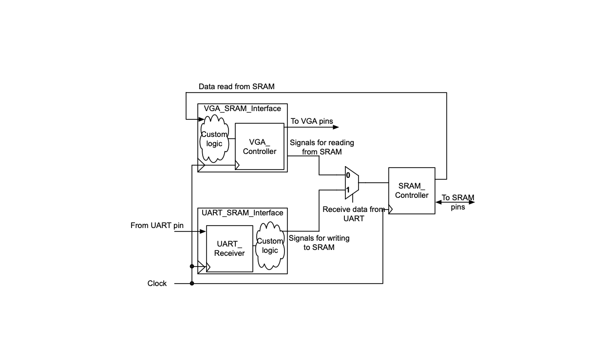
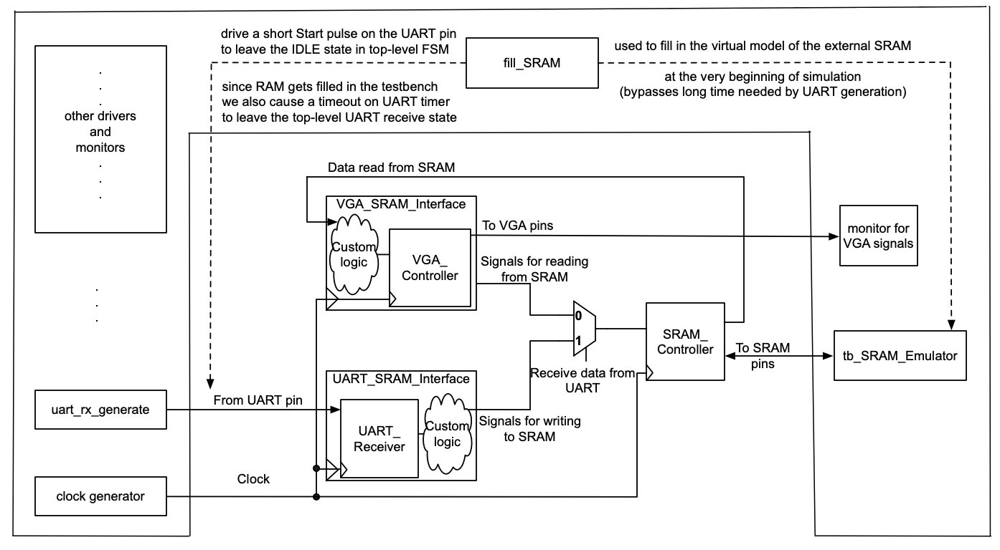

### Experiment 4

In this experiment you will put together the UART, SRAM and VGA interfaces in order to display images sent from a host, i.e., a personal computer (PC). Using the terminal software available on the PC, you will send PPM files. The PPM format has a small header that contains information such as picture size, which is followed by raw RGB data in the order RGB RGB RGB … There is 1 byte of data for each color for each pixel. An image of size 320x240 will thus require 320x240x3, or 230,400 bytes of raw pixel data stored in the PPM file (in addition to the 15 byte header).

|  |
|:--:|
|**Figure 8** – Top-level diagram of the circuit for __experiment 4__|

The top-level diagram of the circuit for this experiment is shown in Figure 8. It utilizes the different components (i.e., the SRAM Controller, VGA Controller, UART Receiver) that were introduced in the previous labs and/or experiments. The UART SRAM Interface enables you to send the PPM file from the PC and store it in the external SRAM. The VGA SRAM Interface will read the stored image from the SRAM and display it on the screen (based on the same principles detailed in __experiment 1__).

Assuming the UART operates with 1 start bit, 8 data bits and 1 stop bit at 115,200 bits per second, on a hardware setup it would take just above 20 seconds to load a PPM image with 240 rows and 320 columns (230,415 * (1 + 8 + 1) / 115,200), assuming the UART driver on the host does not insert an excessive delay between bytes. This is, naturally, prohibitively long to simulate. Even if we adjust the UART generator in the testbench (the `uart_rx_generate` task) to speed-up the UART transmission rate by a scale factor of 500/7 (note, the FSM in the `UART_receive_controller` is also adjusted to sample the UART input faster at 50 MHz by a scale factor of 434/6), the simulation time would still be on the order of a few minutes (as it can be observed by running the default simulation scripts). If the image size would increase (or, in general, more data is sent from the host), the time needed to simulate the transfer of data to the virtual model of the external SRAM would become practically infeasible. 

|  |
|:--:|
|**Figure 9** – Bypassing the slow SRAM filling through UART in the testbench|

To address the above shortcoming, we can use a `fill_SRAM` task to bypass the unit-under-test (UUT) when transferring the data from the host to the external SRAM. The principle of this method is illustrated in the above figure. First, we must generate a Start bit on the UART line to force the top-level FSM from the UUT to leave its IDLE state; while the top-level FSM waits the UART receiver to assemble its first byte, the `fill_SRAM` task from the testbench can already fill in the virtual model of the external SRAM (available in `tb_SRAM_emulator`). At the end of its execution, this task from the testbench forces the UART timer from the UUT to a large value (close to its timeout limit) in order to indicate to the top-level FSM from the UUT that the UART transmission is complete.  Hence, the virtual model of the SRAM can be filled faster in simulation than the first byte would have been assembed by the UART receiver. As effective as this method can be, it is important to acknowledge that it can be used only when the UART to SRAM interface has been adequately validated beforehand.
 
You have to perform the following tasks in the lab for this experiment:

* understand how the entire design works together, including its top-level testbench and its self-checking features
* disable the `uart_rx_generate` task and enable the `fill_SRAM` task in the testbench and observe the speed-up in simulation time

